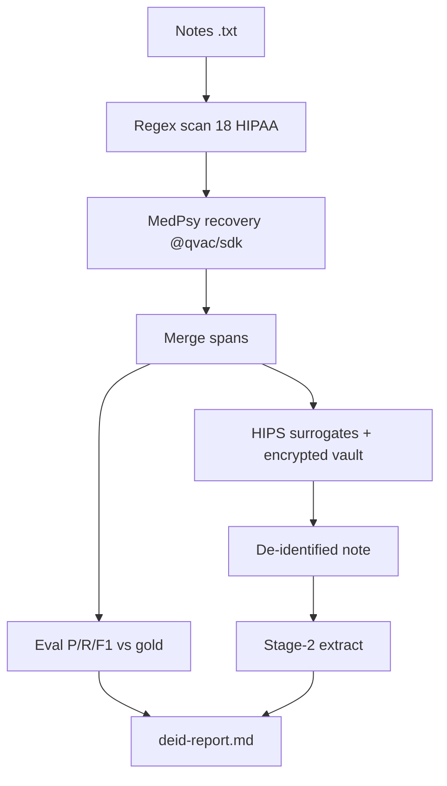

# Scrubd

Fully **offline** clinical-note PHI de-identifier for the QVAC Hackathon. Detects 18 HIPAA Safe Harbor categories via regex, recovers misses with MedPsy via `@qvac/sdk`, replaces PHI with realistic consistent surrogates (HIPS), and evaluates against a synthetic gold set.

## One-command repro

```bash
npm install
npm run build

# Place MedPsy GGUF at ./models/medpsy-1.7b-q4_k_m-imat.gguf
npm run gen-gold -- 20 --out ./tmp/gold

npx scrubd ./tmp/gold/notes --eval --stage2 --out ./tmp/out
# → disguised notes, vault, deid-report.md, runlog.csv
```

## Architecture



## HIPS / Vault

- Same real PHI → same realistic fake (hash-seeded `@faker-js/faker`)
- Dates shift by a constant offset per note (intervals preserved)
- AES-256-GCM encrypted vault (scrypt passphrase) enables local `scrubd-relink`

## Span scoring

A predicted span is a **true positive** if it **overlaps** a gold span **and** shares the same `category` (not exact-offset matching).

## CLI

```bash
scrubd <notes-dir> [--eval] [--stage2] [--out <dir>] [--labels <dir>] [--model <path>] [--passphrase <str>] [--no-medpsy]
scrubd-gen <count> --out <dir>
scrubd-relink <note> --out <file> [--vault <path>]
npm run verify-offline
```

## Docker (offline proof)

```bash
docker build -t scrubd .
docker run --network none -v "$PWD/tmp/gold:/app/gold" scrubd /app/gold/notes --eval --stage2
```

## Hardware proof (fill in on target device)

| Metric | Value |
| --- | --- |
| Device | _TBD_ |
| RAM | _TBD_ |
| Model load time | _TBD_ |
| Tokens/sec | _TBD_ (see runlog.csv) |

## Borrowed libraries

| Library | License | Purpose |
| --- | --- | --- |
| `@qvac/sdk` | Apache-2.0 | Local MedPsy inference |
| `@faker-js/faker` | MIT | Realistic PHI surrogates |

## Tests

```bash
npm test
```

Acceptance gates: `test/e2e.test.ts` (requires local MedPsy GGUF) and `test/offline.test.ts`.

## License

Apache-2.0 — see [LICENSE](./LICENSE).
